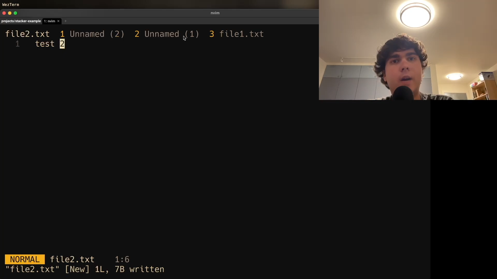

# stacker.nvim

Access recent Neovim buffers, ordered by most recently used

Inspired by [harpoon](https://github.com/ThePrimeagen/harpoon)

## Demo Video

[](https://www.youtube.com/watch?v=d6I0_qKfosg)

## Installation

First install the plugin (using [lazy.nvim](https://github.com/folke/lazy.nvim), for example):

```lua
{
  "tripplyons/stacker.nvim",
  event = "BufEnter",
  config = function()
    -- your config here
  end
}
```

Then call the setup function and create your own keybindings in your config:

```lua
local stacker = require('stacker')
local opts = {}
stacker.setup(opts)

-- <leader>1 will navigate to the most recently used buffer, <leader>2 for 2nd most recently used buffer, etc.
for i = 1, 9 do
  vim.keymap.set('n', '<leader>' .. i, function()
    stacker.navigate(i)
  end)
end

-- <leader>0 will navigate to the 10th most recently used buffer
vim.keymap.set('n', '<leader>0', function()
  stacker.navigate(10)
end)

-- <leader>dh will delete the buffer history for the current directory
vim.keymap.set('n', '<leader>dh', function()
  stacker.clear_history()
end)

-- load the saved buffer history
stacker.load()
```

## Customization

### Default Options

```lua
{
  max_buffers = 10,
  separator = '  ',
  show_tabline = true,
  storage_path = vim.fn.stdpath('data') .. '/stacker.json',
  load_cursor_position = false, # go to the line where the buffer was last left, if using storage
  use_storage = true, # store the buffer history in storage_path
}
```

### Custom Colors

```lua
inactive_color = '#808080' -- replace with a custom color
active_color = '#ffffff' -- replace with a custom color
number_color = '#ff0000' -- replace with a custom color
vim.cmd('highlight! StackerInactive guibg=NONE guifg='..inactive_color)
vim.cmd('highlight! StackerActive guibg=NONE guifg='..active_color)
vim.cmd('highlight! StackerNumber guibg=NONE guifg='..number_color)
```
